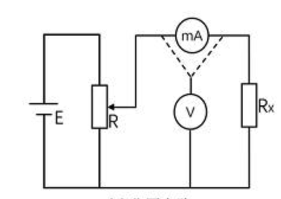
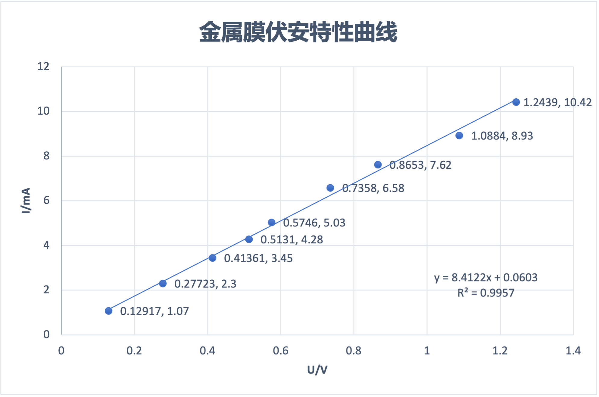
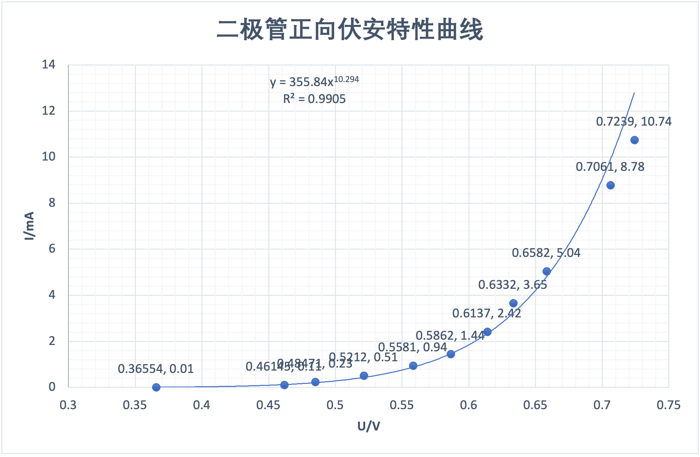

# 伏安法测电阻

2013599 田佳业 2023.4.4

### 实验目的

1.学会设计用伏安法测电阻的实验电路。

2.掌握各种电阻元件伏安特性曲线的测量方法。

3.学会用作图法处理实验数据。

### 实验原理

#### 线性元件和非线性元件

当一电阻元件两端加上不同的直流电压U时，元件内则有相应的电流I流过，以电流I为纵坐标，电压U为横坐标,作出I―U关系曲线,这便是该电阻元件的伏安特性曲线。通常情况下，导电金属丝、碳膜电阻、金属膜电阻等，其伏安特性曲线是一条通过原点的直线，这类元件称为线性元件，其阻值是一个不随I、U变化的常数。对于像晶体二极管、热敏电阻等类元件，它们的伏安特性曲线不是一条直线，这类元件称为非线性元件，其阻值不是常数

#### 仪器选定和连接原理

##### 变阻器

变阻器的用途是用来控制电路中的电压和电流，使其达到某一指定的数值,或使其在一定范围内连续变化。变阻器的连接方式按如下考虑：如所选电源的额定电流大于负载RX额定电流的两倍以上，宜选用分压电路

##### 电表

电表选定后，电表的连接方式有两种，一种是电压表跨接在电流表和电阻的外侧，称为电压表外接法（或电流表内接法）；另一种是电压表跨接在R两端，称为电压表内接法（或电流表外接法）。不论采用哪一种接法，依欧姆定律R=U/I算出的R值，由于电表内阻的影响，都会引入一定的误差。易看出，电压表外接时，测得的R值偏大，电压表内接时测得的R偏小。

本次实验选择分压法，电压表外接。

分压理由：能将电压从0调到最大，更适用于测较大的电阻

用电压表外接法，此次实验希望能够看到较明显的修正效果(非追求误差较小)



### 实验仪器

直流稳压电源：DF1709SB

台式万用表：GDM-8342

手持万用表：UT61B

滑动变阻器：BX7-11

### 万用表测量数据

金属膜电阻$\mathrm{R_{x1}=109.1\Omega}$

低值电阻$\mathrm{R_{x2}=0.9\Omega}$

### 伏安法测量数据

直流电源输出电压$\mathrm{3.00V}$

#### 金属膜电阻

###### 原始数据表

| U/V  | 0.12917 | 0.27723 | 0.41361 | 0.5131 | 0.5746 | 0.7358 | 0.8653 | 1.0884 | 1.2439 |
| ---- | ------- | ------- | ------- | ------ | ------ | ------ | ------ | ------ | ------ |
| I/mA | 1.07    | 2.3     | 3.45    | 4.28   | 5.03   | 6.58   | 7.62   | 8.93   | 10.42  |

###### 数据处理



使用最小二乘法线性拟合，得：$y=8.4122x+0.0603 \quad R^2=0.9957$

$b$很小，$R^2$很大，说明符合线性电阻特征，且拟合效果较好。

则下式中$U_2$和$U_1$分别取测量最大值和最小值。$I_2$和$I_1$同理。

根据仪表显示情况判断测量误差, 再由此计算金属膜电阻的测量误差:
$$
\Delta U=\pm(0.0002\times1.2439+0.0001) \mathrm{~V}, \\
\Delta I=\pm(0.012\times10.42+3\times0.01) \mathrm{~mA}
$$
相对误差: 
$$
\rho_x=\sqrt{\rho_u^2+\rho_i^2}=\sqrt{\left(\frac{\Delta U}{U_2-U_1}\right)^2+\left(\frac{\Delta I}{I_2-I_1}\right)^2}=0.018
$$
绝对误差: $\Delta R=\overline{R_x} \times \rho_x=2.1$
最终测量结果为: $R_x=(116 \pm 2) \Omega$

```python
import math

u2 = 1.2349
u1 = 0.12917
i2 = 10.42
i1 = 1.7
r_a = 2
i2 = i2 * 1e-3
i1 = i1 * 1e-3
# according regression argument in excel
regression_k = 8.4122
regression_k = regression_k * 1e-3
r_x = 1 / regression_k - r_a
delta_u = 2e-4 * u2 + 1e-4
# delta_i is mA! so i2 * 1000
delta_i = 0.012 * i2 * 1000 + 3 * 0.01
# convert mA to A
delta_i = delta_i * 1e-3
delta_r = math.sqrt((delta_u / (u2 - u1)) ** 2 + (delta_i / (i2 - i1)) ** 2)
print("delta_r = {}".format(delta_r))
abs_delta_r = delta_r * r_x
print("r_x = {}±{}".format(r_x, abs_delta_r))

#output:
#delta_r = 0.017782585492447493
#r_x = 116.87496730938399±2.0783390981061265
```

#### 晶体二极管

晶体二极管正向伏安特性原始数据表

| U/V  | 0.36554 | 0.46145 | 0.48471 | 0.5212 | 0.5581 | 0.5862 | 0.6137 | 0.6332 | 0.6582 | 0.7061 | 0.7239 |
| ---- | ------- | ------- | ------- | ------ | ------ | ------ | ------ | ------ | ------ | ------ | ------ |
| I/mA | 0.01    | 0.11    | 0.23    | 0.51   | 0.94   | 1.44   | 2.42   | 3.65   | 5.04   | 8.78   | 10.74  |



虽然理论上应当是指数增长的，但由于为避免损坏二极管未测量更大的电流，因此在实验数据下使用乘幂拟合效果较好。

在 $2.00 \mathrm{~mA}$ 下的阻值 $=\frac{U_a}{I_a}=\frac{0.6045}{0.0020}=302\Omega$
在 $8.00 \mathrm{~mA}$ 下的阻值 $=\frac{U_b}{I_b}=\frac{0.6916}{0.0080}=86\Omega$

```python
import math

# i=355.84u^10.294
# i=2
u1 = 2 / 355.84
u1 = math.pow(u1, 1 / 10.294)
print("x1 = {}".format(u1))
# i=8
u2 = 8 / 355.84
u2 = math.pow(u2, 1 / 10.294)
print("x2 = {}".format(u2))
r1 = u1 / 0.002
r2 = u2 / 0.008
print("r1 = {}".format(r1))
print("r2 = {}".format(r2))
```

思考题第二题

