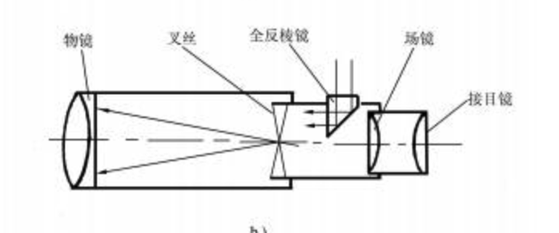
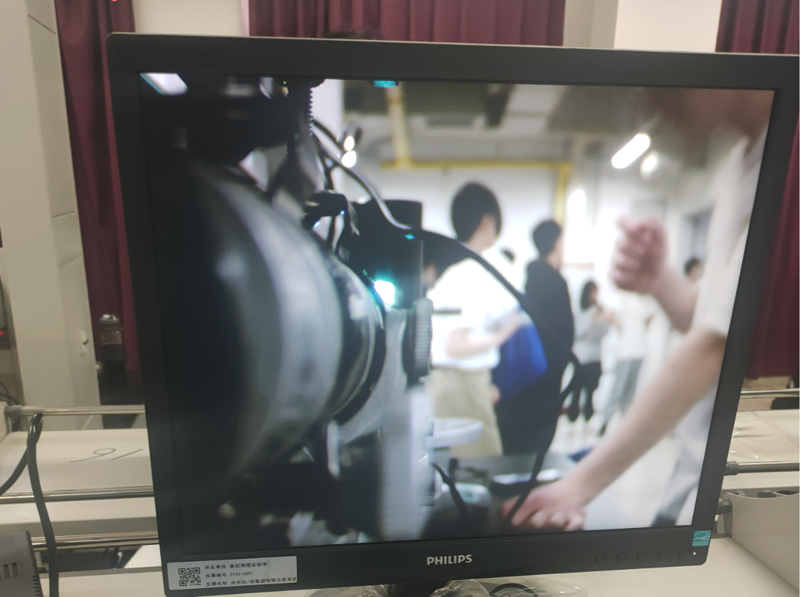
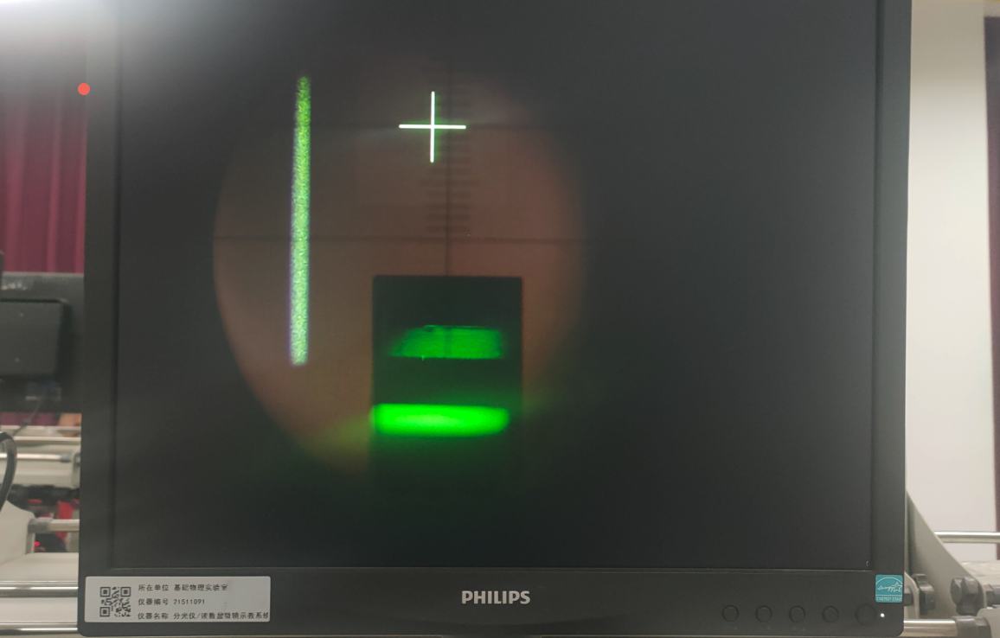
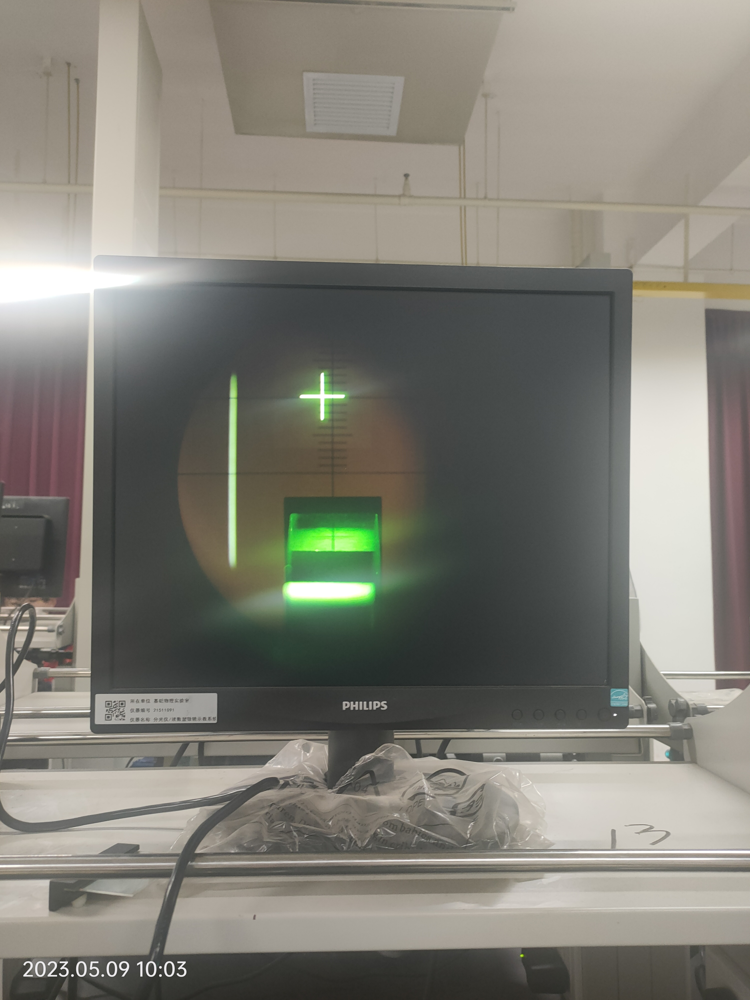
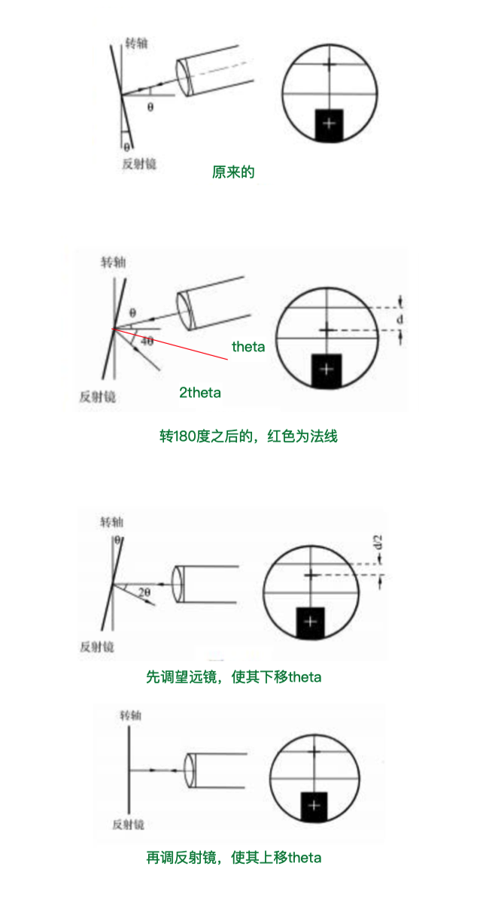

# 分光仪的使用

田佳业 计算机学院 2013599 A组13号

2023.5.9

### 实验目的

了解分光仪的结构和原理

掌握分光仪的调节和使用方法

为后面衍射光栅实验打下基础

### 实验原理

分光仪在测量前需要达到以下状态才可使用。

- 望远镜的光轴与仪器的转轴垂直并能对平行光能很好地成象。

- 平行光管的光轴与仪器的转轴垂直并能出射平行光。

本次实验采用自准法调节分光仪。

### 分光仪结构

#### 望远镜

望远镜的目镜由场镜和接目镜组成。本实验中使用的望远镜的目镜是阿贝目镜。在目镜和叉丝之间装有一个全反射小三棱镜，侧面的照明光源经三棱镜后照亮叉丝的一部分。

#### 平行光管

平行光管平行光管的作用是产生平行光。它是由一个消色差的凸透镜和可变狭缝组成。狭缝和透镜之间的距离可以改变。当用光源照亮狭缝，并将狭缝调节到凸透镜的焦平面上时，从平行光管出射的光就是平行光。平行光管同样是固定在一个支架上，它的角度位置是不可变的。但是可以通过微调螺丝，稍微改变平行光的出射方向。平行光管的俯仰同样可以调节。

#### 载物台

载物台是用来放置被测元件的。在载物台下面有三个调节螺丝，可以用来调节载物台的倾斜程度。载物台可以单独绕仪器的中心轴旋转，也可以通过螺丝将载物台和读数装置固定在一起，共同绕仪器的中心轴旋转。

#### 读数装置

读数装置读数装置是由刻度盘和两个游标组成。两个游标相隔180°，并且在通过仪器中心轴的直径上。游标和刻度盘各自有自己的转轴，可以分别绕仪器的中心轴转动。这次实验暂时用不到读数装置。

### 实验步骤

#### 目测粗调

用眼睛从分光仪的各个侧面估测，使望远镜和平行光管大致与仪器的中心轴垂直。

调节相机焦距，使其大概聚焦于两个螺丝中间，再细调目镜使其能够清楚的看到叉丝。

#### 利用自准法将望远镜调焦于无限远

调节平面反射镜和望远镜的俯仰使得从望远镜中能看到反射回来的叉丝象，这时对望远镜进行调焦，当反射回来的叉丝象变的最清晰，并且与叉丝之间没有视差时，叉丝与叉丝象都位于望远镜物镜的焦平面上。此时，望远镜就被调焦于无限远。

具体是调望远镜上最大的旋钮对望远镜进行调焦。

如果发现刻度不水平，可以把目镜后侧的螺丝拧松，转动目镜使像水平。

#### 各半调节法

如果反射叉丝象与叉丝之间的距离为$d$，调节望远镜的俯仰使反射叉丝象向叉丝移动$d/2$的距离，在此之后，在调节平面反射镜的俯仰，使反射叉丝象与叉丝重合。事实上凭目测很难准确判断$d/2$的距离，因此还需将平面反射镜再转180°，再用各半调节法进行调节。这样反复几次，直到平面反射镜两面的反射叉丝象都与叉丝重合为止。

- 需要注意调整的顺序
- 需要保证载物台是大致水平的，看中间的缝隙各个方向是否一致
- 如果将半透半反镜放置于载物台上的线重合，可以只调两个俯仰螺丝

#### 调平行光管

调节平行光管使之出射平行光，并且其光轴和仪器转轴垂直。

调光管侧方最大的螺丝，能够调节狭缝与平行光管物镜之间的距离，使能从望远镜中观察到边缘清晰，而且与叉丝之间无视差的狭缝象。这时平行光管己能出射平行光。再调光管下方的螺丝，以调整光管俯仰，使视野中下方的刻度线等分狭缝像。

手机拍摄有散光，实际上三个部分都是清晰的。

### 实验总结分析

使用各半调节法的目的是使望远镜的光轴与仪器的转轴垂直。

如果只调一次重合，只能说明望远镜的光轴图和反射镜的法线平行，即望远镜垂直于反射镜。但不能说明望远镜的光轴与仪器的中心转轴相互垂直。这时将平面反射镜转轴绕仪器的中心转轴转180°，就会又不重合，甚至在望远镜中看不到反射回来的叉丝象。

之所以望远镜和反射镜各调$d/2$，是因为其各自需要偏转相同的角度。具体可以看下图。根据几何光学，书中$4\theta$部分实际上是$3\theta$

