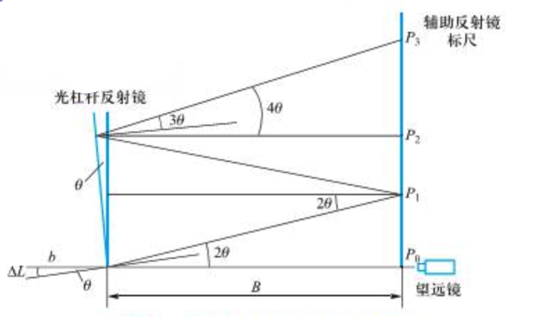

# 用伸长法测定金属丝的杨氏模量

2013599 田佳业 2023.3.14

### 实验目的

1.用伸长法测定金属丝的杨氏模量。
2.了解望远镜尺组的结构及使用方法。
3.掌握用光杠杆放大原理测量微小长度变化量的方法。
4.学习用对立影响法消除系统误差的思想方法。
5.学习用环差法处理数据。

### 仪器用具

由于实验室空间有限，本次实验使用的是可以通过二次放大减小观察距离的B款杨氏模量测定仪。

其他用具包括杨氏模量测定仪、螺旋测微器、游标卡尺、钢卷尺等。

### 原理

#### 测量原理--放大法

若长为 $L$ 、截面积为 $S$ 的均匀金属丝, 在其长度方向上施加作用文使其伸长 $\Delta L$, 根据胡克定律: 在弹性限度范围内, 正应力 $F / S$ (单位面积矢的垂直作用力) 与线应变 $\Delta L / L$ (金属丝相对伸长) 成正比, 即
$$
\frac{F}{S}=E \frac{\Delta L}{L}
$$
上式中比例系数 $E$ 即为该金属丝的杨氏模量。改写为
$$
E=\frac{F L}{S \Delta L_L}
$$
 $F 、 S$ 及 $L$ 比较容易测量, 由于金属的杨氏模量一般较大, 因此, $\Delta L$ 是 一个微小的长度变化, 很难用普通测黄信度的仪器将它测准。
放大法是一种应用分广泛的测量技术。如螺旋测微器是通过机械放大而提高测量精度的; 光 杠杆属于光放大技术, 且其被广泛地应用到许多高灵敏度仪器中, 如光电反射式检
若微小变化量用 $\Delta L$ 表示, 放大后的测量值为 $N$, 则
$$
A=\frac{N}{\Delta L}
$$
为放大器的放大倍数, 原则上 $A$ 越大, 越有利于测量, 但往往会引起信号失真。

#### 光杠杆放大法工作原理


$$
\begin{aligned}
\Delta h & =\left|P_3-P_0\right|=\left|P_3-P_2\right|+\left|P_2-P_1\right|+\left|P_1-P_0\right| \\
& =B \tan 4 \theta+B \tan 2 \theta+B \tan 2 \theta
\end{aligned}
$$
由于 $\theta$ 很小, 即可做近似 $\tan \theta=\theta=\frac{\Delta L}{b}$, 所以 $\Delta h=8 B \theta=8 B \frac{\Delta L}{b}, \Delta L=\frac{b \Delta h}{8 B}$ 代入可得
$$
E=\frac{32 B L m g}{\pi D^2 b \Delta h}
$$

### 数据处理

#### 原始数据

金属丝直径d

螺旋测微器 分度值：0.01mm 零点读数$d_0$=-0.002mm

| n     | 1     | 2     | 3     | 4     | 5     | 6     | avg   |
| ----- | ----- | ----- | ----- | ----- | ----- | ----- | ----- |
| $d_i$ | 0.796 | 0.808 | 0.800 | 0.795 | 0.798 | 0.805 | 0.800 |

伸长量记录(cm)

| 次数 | 拉力示值 | N+   | N-   | 平均  |
| ---- | -------- | ---- | ---- | ----- |
| 1    | 0.3      | 2.72 | 2.71 | 2.715 |
| 2    | 0.4      | 3.18 | 3.20 | 3.19  |
| 3    | 0.5      | 3.68 | 3.75 | 3.715 |
| 4    | 0.6      | 4.25 | 4.21 | 4.23  |
| 5    | 0.7      | 4.69 | 4.62 | 4.655 |
| 6    | 0.8      | 5.12 | 5.15 | 5.135 |
| 7    | 0.9      | 5.57 | 5.70 | 5.635 |
| 8    | 1.0      | 6.08 | 6.12 | 6.1   |
| 9    | 1.1      | 6.45 | 6.40 | 6.425 |
| 10   | 1.2      | 6.95 | 6.95 | 6.95  |

环差值

| N1=P6-P1 | N2    | N3    | N4    | N5    | N     |
| -------- | ----- | ----- | ----- | ----- | ----- |
| 2.42     | 2.445 | 2.385 | 2.195 | 2.295 | 2.348 |

金属丝长度

L=38.20-0.55cm=37.65cm

平面镜到标尺距离

D=70.98-1.00=69.98cm

光杠杆常量

b=6.60-2.00=4.60cm

等效砝码质量

m=5\*10\*0.1kg=5kg

$\bar{E}=\frac{32DLmg}{\pi d^2 bN}$=$1.90\times 10^{11} Pa$
$$
\begin{aligned}
& \mu_{NA}=t_{(0.683,4)}S_{\bar{N}}=1.14~\sqrt{\frac{\sum_{i=1}^5\left(N_i-N\right)^2}{5(5-1)}} \\
& \mu_{NB}=\frac{0.05 \mathrm{~cm}}{\sqrt3} \\
& \mu_{N}=\sqrt{\mu_{NA}^2+\mu_{NB}^2} \\
& \mu_{dA}=t_{(0.683,5)}S_{\bar{d}}=\sqrt{\frac{\sum_{i=1}^6\left(d_i-\bar{d}\right)^2}{6(6-1)}} \\
& \mu_{dB}=\frac{0.004 \mathrm{~cm}}{\sqrt3} \\
& \mu_{d}=\sqrt{\mu_{dA}^2+\mu_{dB}^2} \\
& \mu_{L}=\mu_{D}=\mu_{b}=0.05~cm \\
\end{aligned}
$$

$$
\mu_E=\bar{E}~\sqrt{\left(\frac{\mu_L}{L}\right)^2+\left(\frac{\mu_D}{D}\right)^2+\left(\frac{2 \mu_d}{d}\right)^2+\left(\frac{\mu_N}{N}\right)^2+\left(\frac{\mu_b}{b}\right)^2}
$$

$E=\bar{E}\pm \mu_E=1.90\pm0.12\times 10^{11} Pa$

#### 计算过程

```python
import math

# t(0.683,2) = 1.32, t(0.683,3) = 1.20,etc.
ConfidenceProbability = [1.32, 1.20, 1.14, 1.11, 1.09, 1.08, 1.07, 1.06, 1.03, 1]


def get_uncertainty_a(data):
    """
    Calculate the uncertainty of the data.
    """
    n = len(data)
    t = 0
    if n == 0:
        raise ValueError("测量次数不能为零！")
    elif n < 3:
        print("测量次数不能少于三次！")
    elif n < 10:
        t = ConfidenceProbability[n - 3]
    elif n < 20:
        t = ConfidenceProbability[7]
    elif n == 20:
        t = ConfidenceProbability[8]
    else:
        t = ConfidenceProbability[9]
    x_sum = 0
    for i in range(n):
        x_sum += data[i]
    x_aver = x_sum / n
    x_SquDif = 0
    for i in range(n):
        x_SquDif += (data[i] - x_aver) ** 2
    s_x = math.sqrt(x_SquDif / (n - 1))
    s_x_bar = s_x / math.sqrt(n)
    ua = t * s_x_bar
    return ua


if __name__ == "__main__":
    # 金属丝伸长长度,单位cm
    N_list = [2.42, 2.445, 2.385, 2.195, 2.295]
    N_list = [i * 1e-2 for i in N_list]
    u_NA = get_uncertainty_a(N_list)
    u_NB = 5e-4 / math.sqrt(3)
    u_N = math.sqrt(u_NA ** 2 + u_NB ** 2)
    print("u_N = {}".format(u_N))
    # 金属丝直径,单位mm
    d_list = [0.796, 0.808, 0.800, 0.795, 0.798, 0.805]
    d_list = [i * 1e-3 for i in d_list]
    u_dA = get_uncertainty_a(d_list)
    u_dB = 4e-5 / math.sqrt(3)
    u_d = math.sqrt(u_dA ** 2 + u_dB ** 2)
    u_L = 5e-4
    u_D = 5e-4
    u_b = 5e-4
    D = 0.6998
    L = 0.3765
    m = 5
    g = 9.8
    d_sum = 0
    for i in range(len(d_list)):
        d_sum += d_list[i]
    d = d_sum/ len(d_list)
    b = 0.0460
    N_sum = 0
    for i in range(len(N_list)):
        N_sum += N_list[i]
    N = N_sum/ len(N_list)
    E = 32 * D * L * m * g / (math.pi * d * d * b * N)
    print("E = {}".format(E))
    # 科学计数法表示
    print("E = {:.2e}".format(E))
    u_E = math.sqrt(
        math.pow(u_L / L, 2) + math.pow(u_D / D, 2) + math.pow(u_N / N, 2) + math.pow(2*u_d / d, 2) + math.pow(
            u_b / b, 2)) * E
    print("u_E = {}".format(u_E))
    # 科学计数法表示
    print("u_E = {:.2e}".format(u_E))
```

### 问题讨论

#### 考查题

1.实验中公式成立的条件

力的方向在长度方向上；平面镜的偏转角很小；光杠杆三足尖在同一水平面内；平面镜及标尺竖直

保证的办法：使金属丝竖直放置，望远镜与光杠杆距离适当加大

2.尺读望远镜的部件及其调节步骤

尺读望远镜的主要构成部件：内调焦望远镜、灯尺、三脚架立柱、反光镜

快速找到标尺成像的步骤：

```
调节望远镜的目镜与物镜焦距

使望远镜镜头与光杠杆平面镜等高

将望远镜向后移动1m左右

从目镜端以准星仔细瞄准目标(标尺)

调节内调焦手轮，调整视距
```

3.使用杨氏模量测定仪时要注意什么？其中哪些是为了保护仪器的，哪些是为了提高测量精度的？

- 保持光学镜面清洁，不得用手触摸，镜面有灰尘时，应以软毛刷轻拭，且用毕应盖好物镜罩。

- 调节望远镜时，动作要轻，且尽量不靠微动手轮瞄准目标，伸长仪及望远镜尺组应避免撞击和剧烈振动：
- 应保护光杠杆刀刃、足尖及平面镜，严禁磕碰和跌落：其固定螺丝不得旋得过紧，以防平面镜变形：
- 测像移过程中不得碰动仪器的任何部位，且加减砝码时动作要轻，防止砝码托摆动，以提高测量精度。

4.哪些量要多次测量，哪些单次测量，为什么

测量误差较大的使用多次测量，即金属丝直径和伸长量。容易测量，且对实验结果影响小的量单次测量即可，如平面镜到标尺距离。

5.调节好仪器后的第一个读数，如果是在直尺的最上端或最下端附近，对实验的进行有否影响？如何改进？

有影响。读数可能会偏差较大。如果在最上端附近可以一开始多加几个砝码。反之同理。

#### 思考题

1.哪两个量的测量误差较大？在测量和数据处理中采取了什措施？

金属丝直径和伸长量。直径采用多次不同位置方向测量求平均值。伸长量采用光放大法测量，使用对立影响法减小系统误差，处理数据用了环差法。

2.根据光杠杆放大原理：△h=2B△L/b，能否以增大B减小b的方法来提高放大倍率？这样做有无好处？有无限度？应怎样考虑之？

可以。但实验空间有限，且要保证能够看清标尺，B不可能无限增加，b由于仪器制作工艺减小的程度也有限。可以像B类测量仪一样采用多次放大。

。
