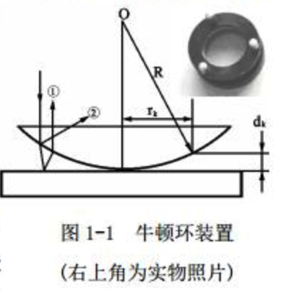
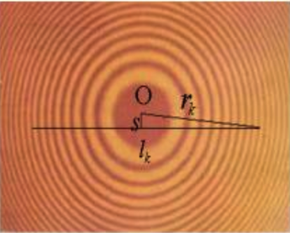
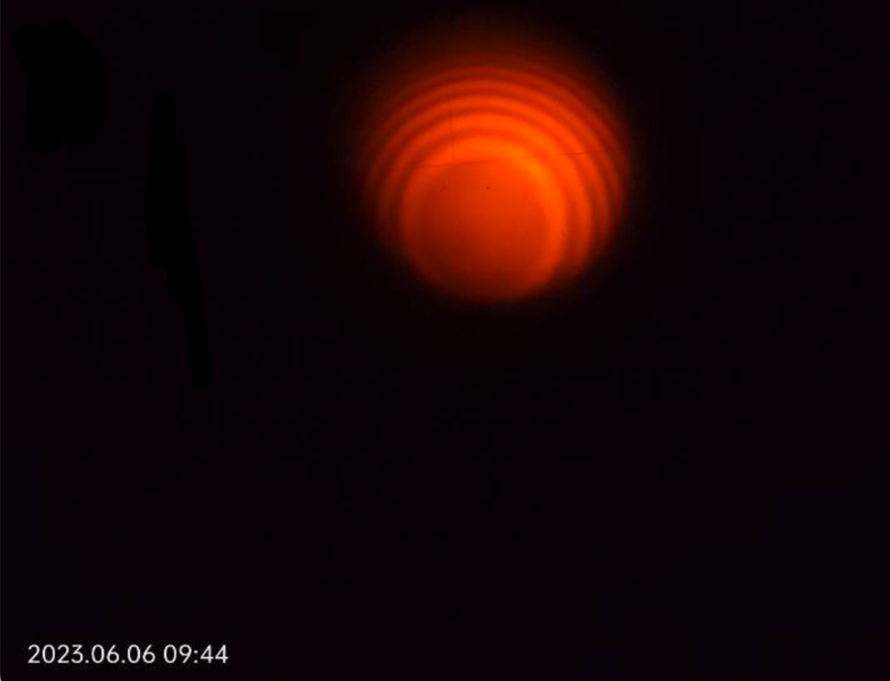
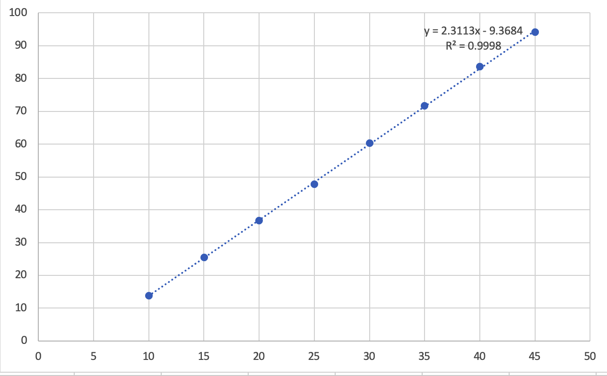
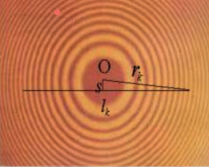

# 牛顿环

田佳业 2013599 计算机学院 A 2023.6.6

### 仪器用具

牛顿环装置，钠灯，读数显微镜

### 实验原理

牛顿环是一个典型的分振幅等厚干涉。通常利用它来检查一些介质表面的形状。 上图为牛顿环装置。 $\mathrm{R}$ 为被测透镜凸面的曲率半径, $r_k$ 是第 $\mathrm{k}$ 级干涉环的半径, $d_k$ 是第 $\mathrm{k}$ 级干涉环所对应的空气间隙的厚度。如果入射光的波长为 $\lambda$, 则第 $\mathrm{k}$ 级干涉环所对应的光程差为:
$$
\Delta_k=2 d_k+\lambda / 2
$$
其中, $\lambda / 2$ 为光由光疏介质入射到光密介质时, 反射光的半波损失。因此, 在接触点处 $\left(d_0=0\right)$ 的光程差为:
$$
\Delta_0=\lambda / 2
$$
在理想情况下，牛顿环的中心是一个几何暗点。但在实际情况中，透镜和平板玻璃接触时，由于有重力和压力存在，透镜的凸面和平板玻璃均发生形变，两者的接触不再是点接触，而是面接触。因此，牛顿环的零级暗条纹不是个点，而是一个较大的暗斑。

我们现在想测量被测透镜凸面的曲率半径。容易得到的是干涉环半径，波长已知。尝试将曲率半径用易测量的量表示：

第 $\mathrm{k}$ 级干涉暗环处的光程差为:
$$
\Delta_k=2 d_k+\lambda / 2=(k+1 / 2) \lambda
$$
所对应的空气间隙的厚度为:
$$
d_k=k \lambda / 2
$$
实际上, 因 $R \gg d_k$, 所以有
$$
r_k^2=R^2-\left(R-d_k\right)^2 \approx 2 R d_k
$$
将$d_k$代入得, 第 $\mathrm{k}$ 级干涉暗环的半径为:
$$
r_k=\sqrt{k \lambda R}
$$
在实验中用给定波长的光进行照明时, 只要测得第 $\mathrm{k}$ 级干涉暗环的半径 $r_k$, 就可以得到曲率半径 $R$ 。

事实上，由于无法准确确定干涉环的圆心所在位置, 干涉环的半径还是不可能准确地测量。但至少弦长是能够准确测量的。假设这个弦到圆心的距离是 $\mathrm{s}$, 由图中的几何关系可知:

$$
l_k^2=4\left(r_k^2-s^2\right)
$$
可以得到所测弦长与透镜曲率半径之间满足以下关系:
$$
l_k^2=4 k \lambda R-4 s^2
$$
可以看到弦长的平方与干涉环的级次间是一个线性关系。在测量中，可以测量一组不同级次干涉环在某一直线上的弦长，利用最小二乘法或作图法求得该直线的斜率$4\lambda R$，再利用已知的波长得到凸透镜的曲率半径。

### 实验现象

### 数据记录

钠光源波长$\lambda$取$589.3nm$

| 干涉环位置$mm$/干涉级数 | 10        | 15        | 20        | 25        | 30        | 35        | 40        | 45        |
| ----------------------- | --------- | --------- | --------- | --------- | --------- | --------- | --------- | --------- |
| 左                      | 47.992    | 48.641    | 49.190    | 49.604    | 50.028    | 50.362    | 50.713    | 50.942    |
| 右                      | 44.279    | 43.595    | 43.132    | 42.690    | 42.259    | 41.898    | 41.565    | 41.241    |
| 弦长/$mm$               | 3.713     | 5.046     | 6.058     | 6.914     | 7.769     | 8.464     | 9.148     | 9.701     |
| 弦长平方/$mm^2$         | 13.786369 | 25.462116 | 36.699364 | 47.803396 | 60.357361 | 71.639296 | 83.685904 | 94.109401 |

弦长平方和干涉级数的关系曲线(Excel作图)

附：最小二乘法直线拟合原理
设两个物理量 $x, y$ 满足线性关系 $y=a+b x$ 

等精度地测量一组至相独立的实验数据 $\left\{x_i, y_i\right\} \quad i=1,2, \cdots, n$
当所测的各我值与拟合直线 $Y_i=a+b x_i$ 之间的偏差$S$平方和为最小时, 即 $S=\Sigma\left(y_i-Y_i\right)^2$最小时所得的系数 $a, b$ 最好, 拟合公式即最佳经验公式
$S$又称为残差的平方和

$S=\sum_{i=1}^n\left(y_i-a-b x_i\right)^2$
根据微分中求极限的方法可知, $S(a,b)$
取得最小值应满足一阶偏导数为零
$$
\begin{aligned}
& \frac{\partial S}{\partial a}=0 \\
& \frac{\partial S}{\partial b}=0
\end{aligned} \Rightarrow\left\{\begin{array}{l}
\frac{\partial S}{\partial a}=-2 \Sigma\left(y_i-a-b x_i\right)=0 \\
\frac{\partial S}{\partial b}=-2 \Sigma\left(y_i-a-b x_i\right) x_i=0
\end{array}\right.
$$
整理后得正规方程
$$
\left\{\begin{array}{l}
\sum_{i=1}^n y_i=na+b \sum_{i=1}^n x_i \\
\sum_{i=1}^n x_i y_i=a \sum_{i=1}^n x_i+b \sum_{i=1}^n x_i^2
\end{array}\right. \\
$$
引入平均值: 
$$
\bar{x}=\frac{1}{n} \sum_{i=1}^n x_i \quad 
\bar{y}=\frac{1}{n} \sum_{i=1}^n y_i \\
\overline{x^2}=\frac{1}{n} \sum_{i=1}^n x_i^2 \quad \overline{x y}=\frac{1}{n} \sum_{i=1}^n x_i y_i \\
$$
则有 
$$
\bar{y}=a+b \bar{x} \quad n \overline{x y}=n a \bar{x}+n b \bar{x}^2 \\
$$
得方程组 
$$
\left\{\begin{array}{l}
\bar{y}=a+b \bar{x} \\
\overline{x}\overline{y}=a \bar{x}+b \bar{x}^2
\end{array}\right. \\
$$
得 
$$
b=\frac{\overline{x y}-\bar{x}\bar{y}}{\overline{x^2}-\bar{x}^2} \quad a=\bar{y}-b \bar{x}
$$
相关系数
$$
\begin{aligned}
& r=\frac{(\overline{x y}-\bar{x} \cdot \bar{y})}{\sqrt{\left(\bar{x^2}-\bar{x}^2\right)\left(\bar{y^2}-\bar{y}^2\right)}} \quad r \in[-1,1] \\
& U_b=b \sqrt{\frac{1}{n-2}\left(\frac{1}{r^2}-1\right)} \quad U_a=\sqrt{\bar{x^2}} \cdot U_b
\end{aligned}
$$
物理实验要求达到0.999以上就可以。可以看到本次实验的$R^2=0.9998$，说明数据线性性良好。

代入数据得到

$b=2.311,R=\frac{b}{4\lambda}=340.5mm$

$U_b=0.013，U_a=0.367$

### 思考题

1.牛顿环倒着放，如果是像实验中平板玻璃和凸透镜是整体的，仍旧可以形成空气间隙，但是无法形成干涉现象，因此不能正常实验

2.测弦长不必须通过中心大暗斑，但比如我们从第10级干涉环开始数，那至少要通过第10级的干涉环，否则图中的几何关系无法保证

3.中心暗斑大小不影响实验结果

4.可以观察到实验现象，会是彩虹色的干涉光环。红的在里侧紫的在外侧，但是无法使用白光完成测量曲率半径的实验。