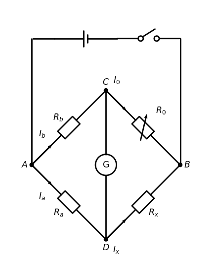
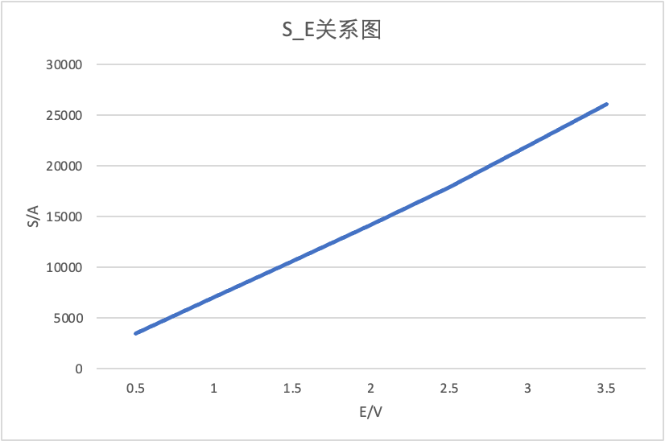

# 直流单臂电桥

田佳业 计算机学院 2013599 A组13号

2023.4.18

### 实验原理

##### 适用范围

本实验所讨论的是直流单臂电桥（又称惠斯登电桥），主要是用来测量中等阻值($10~ 10^5\Omega$)电阻的。

##### 测量公式

直流单臂电桥的原理性电路如图9.1所示。它是由四个电阻$R_a$、$R_b$、$R_0$、$R_x$串联成一个四边形回路，这四个电阻称做电桥的四个“臂”。在这个四边形回路的一条对角线的顶点间接入直流工作电源，另一条对角线的顶点间接入电流计，这个支路一般称做“桥”。适当地调节$R_0$值， 可使C、D两点电位相同，电流计中无电流流过，这时称电桥达到了平衡。在电桥平衡时有：

$$
\begin{aligned}
& R_a I_a=R_b I_b \\
& R_x I_x=R_0 I_0 \\
& I_a=I_x, I_b=I_o \\
&
\end{aligned}
$$
则上式整理可得:
$$
R_x=\frac{\mathrm{R}_{\mathrm{a}}}{\mathrm{R}_{\mathrm{b}}} R_0
$$
为了计算方便，通常把$R_a/R_b$比值选作成$10^n(n=0，±1，±2，…)$。令$C=R_a/R_b$， 则：
$$
R_x=CR_0
$$


可见电桥平衡时, 由已知的 $R_a 、 \mathrm{R}_{\mathrm{b}}$ (或$ C$) 及 $R_0$ 值便可算出 $R_0$ 人们常把 $\mathrm{R}_{\mathrm{a}} 、 \mathrm{R}_{\mathrm{b}}$ 称做比例臂, $\mathrm{C}$ 为比例臂的倍率; $R_0$ 称做比较臂:$R_x$称做待测臂。

#### 电路图



##### 比例臂选取原则

电桥由非平衡态达到平衡态的过程中，需要调节比较臂电阻。显然$R_0$调节位数越多， 对电桥的平衡调节得越精细，由此给测量带来的误差就越小。为此在测量时要恰当地选取倍率$C$，以使尼调节的有效位数尽量多。

#### 电桥灵敏度概念和影响因素

电桥的平衡在实验上是通过电流计的示数来判断的。当通过电流计的电流小于其分辨率 $\delta$ 时, 我们不能判断电桥是否偏离平衡, 仍认为电桥处于平衡态, 从而给测量带来误差。对此, 引入电桥灵敏度的概念, 定义为:
$$
S=\frac{\Delta I}{\frac{\Delta R_X}{R_X}} \text { 或 } S=\frac{\Delta I}{\frac{\Delta R_0}{R_0}}
$$
式中 $R_0$ 是电桥平衡时的阻值; $\Delta R_0$ 是在电桥 平衡后 $R_o$ 的微小改变量; $\Delta I$ 是电桥偏离平衡而引起电流计的示数改变量。故由电桥灵敏度引入被测量 $R$ 的相对误差为:
$$
\frac{\Delta R_X}{R_X}=\frac{\Delta I}{S}
$$
可见电桥灵敏度 $S$ 越大, 电桥越灵敏, 对电桥平衡的判断越精细，测量误差越小。
那么怎样才能增大电桥灵敏度吧? 电桥灵敏度 $S$ 也可由基尔霍夫定律推出。若忽略电源 内阻，其表达式为:
$$
S=\frac{\mathrm{E}}{\mathrm{K}\left[\left(\mathrm{R}_{\mathrm{a}}+\mathrm{R}_{\mathrm{b}}+R_0+R_X\right)+\left(2+\frac{\mathrm{R}_{\mathrm{b}}}{R_0}+\frac{R_X}{\mathrm{R}_{\mathrm{a}}}\right) \mathrm{R}_{\mathrm{g}}\right]}
$$
式中 $K 、 R_{\mathbb{8}}$ 分别为电流计的电流常数和内阻。由此式可见, 适当提高电源电压 $E 、$ 选择电流常数 $K$ 和内阻 $R_g$ 适当小的灵敏电流计、适当减小桥臂电阻 $\left(R_a+R_{\Delta}+R_0+R_r\right)$ 、尽量把桥臂配置成均 压状态 (即四臂电压相等), 使上式中的 $\left(2+\frac{\mathrm{R}_{\mathrm{b}}}{\mathrm{R}_0}+\frac{\mathrm{R}_X}{\mathrm{R}_{\mathrm{a}}}\right)$ 值最小, 这些对提高电桥灵敏度均有作用, 但需根据具体情况灵活运用。

##### 换臂法

此外, 采取一定的测量方法, 可以消除某些误差, 提高测量精度。例如在自组单桥测电 阻 $R_{\mathrm{r}}$ 中, 当选取倍率 $\mathrm{C}=1$ 进行测量时, 可方便地采用换臂法完全消除倍率 $\mathrm{C}$ 的误差。若电桥平衡时比较臂为 $R_0^{\prime}$, 将 $\mathrm{R}_{\mathrm{a}} 、 \mathrm{R}_b$ 交换位置后, 若电桥再次平衡比较臂为
$R_0^{\prime \prime}$, 待测电阻 $R_x$ 则为:
$$
R_x=\sqrt{R_0^{\prime} \cdot R_0^{\prime \prime}} \approx \frac{1}{2}\left(R_0^{\prime}+R_0^{\prime \prime}\right)
$$
式中倍率$ C$ 不见了, 它的误差自然也就被消除了。

### 数据处理

#### 测量未知电阻$R_x$和灵敏度

$R_x$约$1200\Omega$

$R_a=R_b=100\Omega$,比例臂倍率$C=1$

$$
S=\frac{\Delta I}{\frac{\Delta R_0}{R_0}}
$$


| 电桥状态 | $R_0$  | $R_x$  | $\Delta R_0$ | $\Delta I$ | $S_I$   |
| -------- | ------ | ------ | ------------ | ---------- | ------- |
| 换臂前   | 1183.9 | 1183.9 | 1.5          | 27.9       | 22020.6 |
| 换臂后   | 1183.8 | 1183.8 | 1.5          | 27.8       | 21939.8 |

$$
\rho_x=\sqrt{\rho_0^2+\rho_C^2+\left(\frac{0.1}{S}\right)^2}\\
$$

换臂后
$$
R_x=\sqrt{R_0^{\prime} \cdot R_0^{\prime \prime}} \approx \frac{1}{2}\left(R_0^{\prime}+R_0^{\prime \prime}\right)\\
\rho_x=\sqrt{\rho_0^2+\left(\frac{0.1}{S}\right)^2}\\
$$

且
$$
\Delta R_x=\rho_x R_测\\
R_x=R_测\pm \Delta R_x
$$
$\rho_C=0.1\%,\rho_0=0.1\%$根据上述公式，得到
$$
R_x=1183.9\pm 1.6\Omega (换臂前)\\
R_x=1183.8\pm 1.1\Omega (换臂后)
$$


#### 观察电桥灵敏度和电源电压关系

$R_a=R_b=100\Omega$,$R_x$约为$1200\Omega$。改变电源电压$E$，测量不同电压下的电桥灵敏度，并做$S-E$关系图

| 电源电压$E/V$ | 0.5    | 1.0    | 1.5     | 2.0     | 2.5     | 3.0     | 3.5     |
| ------------- | ------ | ------ | ------- | ------- | ------- | ------- | ------- |
| $R_0$         | 1183.8 | 1183.8 | 1183.8  | 1183.8  | 1183.8  | 1183.8  | 1183.8  |
| $\Delta R_0$  | 7.0    | 5.0    | 3.0     | 2.0     | 2.0     | 1.5     | 1.0     |
| $\Delta I$    | 20.3   | 29.8   | 26.8    | 23.9    | 30.3    | 27.8    | 22.0    |
| $S$           | 3433.0 | 7055.4 | 10575.3 | 14146.4 | 17934.6 | 21939.8 | 26043.6 |



#### 测量未知电阻$R_2$和灵敏度

$R_2$约$50\Omega$

$R_a=10\Omega \quad R_b=1000\Omega$,比例臂倍率$C=1/100$

| 电桥状态 | $R_0$  | $R_x$  | $\Delta R_0$ | $\Delta I$ | $S_I$  |
| -------- | ------ | ------ | ------------ | ---------- | ------ |
| 数据记录 | 5001.8 | 50.018 | 20.0         | 26.7       | 6677.4 |

$R_x=50.01\pm 0.11\Omega$

$\rho_C=0.2\%,\rho_0=0.1\%$

### 思考题

不要求电路中其他电阻值准确，但要求电路稳定。

### 附录

#### 电路图代码

```python
import schemdraw
import schemdraw.elements as elm
import math
# use IEC style
elm.style(elm.STYLE_IEC)
d = schemdraw.Drawing()
Line = d.add(elm.Line().right().length(1))
Battery = d.add(elm.BatteryCell())
d.add(elm.Switch())
d.add(elm.Line().down().length(6))
DotB = d.add(elm.Dot().label('$B$', loc='right'))
d.push()
d.add(elm.ResistorVarIEC().theta(135).flip().label('$R_0$').length(5))
DotC = d.add(elm.Dot().label('$C$'))
d.push()
Rb = d.add(elm.Resistor().theta(225).length(5).label('$R_b$'))
DotA = d.add(elm.Dot().label('$A$', loc='left'))
d.add(elm.Line().up().toy(Line.start))
d.pop()
# rewrite the MeterA for MeterG
MeterG = elm.MeterA()
d.add(MeterG.down().length(5 * 2 / math.sqrt(2)))
MeterG.segments[2].text = 'G'
DotD = d.add(elm.Dot().label('$D$', loc='bottom'))
d.add(elm.Resistor().theta(135).length(5).label('$R_a$', loc='bottom').hold())
d.add(elm.Resistor().theta(45).length(5).label('$R_x$', loc='bottom'))
# add arrow for current
d.add(elm.Wire('-', arrow='->').at(DotA.center).delta(1, 1).label('$I_b$', loc='top'))
d.add(elm.Wire('-', arrow='->').at(DotC.center).delta(1, -1).label('$I_0$', loc='top'))
d.add(elm.Wire('-', arrow='->').at(DotA.center).delta(1, -1).label('$I_a$', loc='bottom'))
d.add(elm.Wire('-', arrow='->').at(DotD.center).delta(1, 1).label('$I_x$', loc='bottom'))
d.draw()
```

#### 计算过程

```python
import math

def calc_s(delta_i, delta_r, r):
    return delta_i * r / delta_r

def calc_rho_x(S, rho_0=1e-3, rho_c=1e-3, is_swap=False):
    if is_swap:
        rho_c = 0
    G_err = 0.1 / S
    return math.sqrt(rho_0 * rho_0 + rho_c * rho_c + G_err * G_err)
```

```python
r0_1 = 1183.9
r0_2 = 1183.8
delta_r0 = 1.5
delta_i_1 = 27.9
delta_i_2 = 27.8
s_1 = calc_s(delta_i_1, delta_r0, r0_1)
s_2 = calc_s(delta_i_2, delta_r0, r0_2)
print("s_1={}".format(s_1))
print("s_2={}".format(s_2))
rho_x_1 = calc_rho_x(s_1, is_swap=False)
print("换臂前rho_x={}".format(rho_x_1))
avg_r_x = (r0_1 + r0_2) / 2
avg_s = (s_1 + s_2) / 2
rho_x_2 = calc_rho_x(avg_s, is_swap=True)
print("换臂后rho_x={}".format(rho_x_2))
delta_rx_1 = r0_1 * rho_x_1
delta_rx_2 = avg_r_x * rho_x_2
print("换臂前Rx={0}±{1}".format(r0_1, delta_rx_1))
print("换臂后Rx={0}±{1}".format(avg_r_x, delta_rx_2))
# s_1=22020.539999999997
# s_2=21939.76
# 换臂前rho_x=0.001414220853555403
# 换臂后rho_x=0.0010000103491922187
# 换臂前Rx=1183.9±1.6742960685242416
# 换臂后Rx=1183.85±1.183862251891208
```


```python
r0=5001.8
rx=r0/100
delta_r0=20
delta_i=26.7
s=calc_s(delta_i,delta_r0,r0)
print("S={0}".format(s))
rho_x=calc_rho_x(s,is_swap=False,rho_c=2e-3)
delta_rx=rx*rho_x
print("rho_x={0}".format(rho_x))
print("Rx={0}±{1}".format(rx,delta_rx))
# S=6677.403
# rho_x=0.002236118126809135
# Rx=50.018±0.1118461564667393
```

