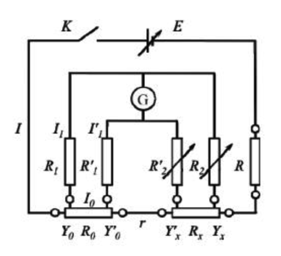

# 直流双臂电桥

田佳业 计算机学院 2013599 A组13号

2023.4.25

### 实验原理

#### 直流双臂电桥适用范围

阻值比较小的电阻，由于有接触电阻和接线电阻的存在，会给测量带来很大的误差，尤其是当这些附加电阻和待测电阻可以比拟时，测量误差就更大了。为了消除这些附加电阻的影响，人们常把低阻做成四端结构，并采用直流双臂电桥进行测量。

#### 四端法

低值电阻为了抵消测量电压时的触电阻和接线电阻，提供了四个端口。外面两个端口接入工作电流，称为“电流接头”，内侧两个端口接测量电压的微安表，称为“电压接头”

#### 测量方法



根据基尔霍夫定律：
$$
\left.\begin{array}{l}
I_1 \mathrm{R}_1=I_0 \mathrm{R}_0+I_1^{\prime} \mathrm{R}_1^{\prime} \\
I_1 R_2=I_0 R_X+\mathrm{I}_1^{\prime} R_2^{\prime} \\
\left(I_0-I_1^{\prime}\right) r=I_1^{\prime}\left(\mathrm{R}_1^{\prime}+R_2^{\prime}\right)
\end{array}\right\}
$$

式中 $I_1 、 I_0 、 I_1^{\prime}$ 分别为电桥平衡时通过电阻 $R_1 、 R_0 、 R_1^{\prime}$ 的电流。整理有:
$$
\mathrm{R}_1 R_X=R_2 \mathrm{R}_0+\left(R_2 \mathrm{R}_1^{\prime}-\mathrm{R}_1 R_2^{\prime}\right) \frac{r}{\left(\mathrm{r}+\mathrm{R}_1^{\prime}+R_2^{\prime}\right)}
$$
如果电桥的平衡是在保证 $R_2 \mathrm{R}_1^{\prime}-\mathrm{R}_1 R_2^{\prime}=0$, 即 $\frac{R_2}{\mathrm{R}_1}=\frac{R_2^{\prime}}{\mathrm{R}_1^{\prime}}$ 的条件下调得的, 那么则可得测量公式：
$$
R_X=\frac{R_2}{\mathrm{R}_1} \mathrm{R}_0
$$
已知 $R_0$ 和比值 $R_2 / R_1$ 就可算出 $R_{\text {0 }}$ 由此知双桥的测量平衡条件为:
$$
\frac{R_2}{\mathrm{R}_1}=\frac{R_2^{\prime}}{\mathrm{R}_1^{\prime}}=\frac{R_X}{\mathrm{R}_0}
$$
选定标准电阻$R_0$后同步调节比例臂电阻$R_2$和$R_2'$，保持平衡条件成立。

#### 电桥灵敏度

双桥平衡后, 将比例臂电阻 $R_2 、 R_2^{\prime}$ 同步地偏调 $\Delta R_2=\Delta R_2^{\prime}$, 若电流计示数改变 $\Delta I$, 则灵敏度 $S$ 为:
$$
S=\frac{\Delta I}{\frac{\Delta R_2}{R_2}}
$$
且 $S=\frac{\Delta I}{\frac{\Delta R_2}{R_2}}=\frac{\Delta I}{\frac{\Delta R_X}{R_X}}$, 故由灵敏度 $S$ 引入被测量 $R_x$ 的相对误差为:
$$
\frac{\Delta R_X}{R_X}=\frac{\Delta I}{S}
$$

### 数据处理

#### 铜棍电阻率测量

1)铜棍长度(两电压接头之间)$l=436.4\pm 0.5mm$

2)铜棍直径

| 测量次数 | 1     | 2     | 3     | 4     | 5     | avg    |
| -------- | ----- | ----- | ----- | ----- | ----- | ------ |
| 直径(mm) | 4.950 | 4.951 | 4.950 | 4.952 | 4.950 | 4.9506 |

测量直径$d=4.951\pm0.023mm$

3)调节电桥平衡

| 电桥状态 | $R_2(=R_2' )$ | $R_x$          | $\Delta R_2(=\Delta R_2' )$ | $\Delta I$ | $S$    |
| -------- | ------------- | -------------- | --------------------------- | ---------- | ------ |
| 数据记录 | 385.0         | $3.85*10^{-4}$ | 20                          | 3.3        | 63.525 |

$$
R_x=\frac{R_2}{\mathrm{R}_1} \mathrm{R}_0
$$

$R_0=0.001\Omega$,$R_1=1000\Omega$
$$
S=\frac{\Delta I}{\frac{\Delta R_2}{R_2}}
$$

$R_x=3.6712\pm0.0014*10^{-3} \Omega$

$R_x$总相对不确定度为
$$
\rho_X=\sqrt{(1+\mathrm{k})^2\left(\rho_2^2+\rho_1^2\right)+\mathrm{k}^2\left(\rho_2^{\prime 2}+\rho_1^{\prime 2}\right)+\rho_0^2+\left(\frac{\delta}{S}\right)^2}=0.003
$$


式中 $\rho_1 、 \rho_2 、 \rho_1^{\prime} 、 \rho_2^{\prime} 、 \rho_0$ 分别为 $R_1 、 R_2 、 R_1^{\prime} 、 R_2^{\prime} 、 \mathrm{R}_0$ 的相对标准不确定度。

上式中五个$\rho$均取$0.1\%$,$\delta=0.1,k$没拍到，按照1算。下面有脚本，如果取错了可以按照程序重新计算，希望不因此扣分。
$$
\rho=\frac{R_xS}{l}=\frac{\pi R_xd^2}{4l}=1.698*10^{-7}\\
{\rho_\rho}=\sqrt{(\rho_X)^2+(\rho_L)^2+(2\rho_d)^2}=0.006
$$
$\rho=1.698\pm0.010*10^{-8}Ωm$

#### 铝棍电阻率测量
1)铝棍长度(两电压接头之间)$l=436.1\pm 0.5mm$

2)铝棍直径

| 测量次数 | 1     | 2     | 3     | 4     | 5     | avg    |
| -------- | ----- | ----- | ----- | ----- | ----- | ------ |
| 直径(mm) | 4.912 | 4.915 | 4.913 | 4.912 | 4.914 | 4.9132 |

测量直径$d=4.913\pm0.023 mm$

3)调节电桥平衡

| 电桥状态 | $R_2(=R_2' )$ | $R_x$          | $\Delta R_2(=\Delta R_2' )$ | $\Delta I$ | $S$    |
| -------- | ------------- | -------------- | --------------------------- | ---------- | ------ |
| 数据记录 | 929.0         | $9.29*10^{-4}$ | 20                          | 3.0        | 139.35 |

$R_x=3.3934\pm0.0031*10^{-3} \Omega$

$R_x$总相对不确定度为
$$
\rho_X=\sqrt{(1+\mathrm{k})^2\left(\rho_2^2+\rho_1^2\right)+\mathrm{k}^2\left(\rho_2^{\prime 2}+\rho_1^{\prime 2}\right)+\rho_0^2+\left(\frac{\delta}{S}\right)^2}=0.003
$$
式中 $\rho_1 、 \rho_2 、 \rho_1^{\prime} 、 \rho_2^{\prime} 、 \rho_0$ 分别为 $R_1 、 R_2 、 R_1^{\prime} 、 R_2^{\prime} 、 \mathrm{R}_0$ 的相对标准不确定度。

上式中五个$\rho$均取$0.1\%$,$\delta=0.1,k$没拍到，按照1算。下面有脚本，如果取错了可以按照程序重新计算，希望不因此扣分。
$$
\rho=\frac{R_xS}{l}=\frac{\pi R_xd^2}{4l}=4.038*10^{-8}\\
{\rho_\rho}=\sqrt{(\rho_X)^2+(\rho_L)^2+(2\rho_d)^2}=0.006
$$
$\rho=4.038\pm0.024*10^{-8}Ωm$

#### 铁棍电阻率测量

1)铁棍长度(两电压接头之间)$l=436.9\pm 0.5mm$

2)铁棍直径

| 测量次数 | 1     | 2     | 3     | 4     | 5     | avg    |
| -------- | ----- | ----- | ----- | ----- | ----- | ------ |
| 直径(mm) | 4.919 | 4.925 | 4.920 | 4.923 | 4.925 | 4.9222 |

测量指直径$d=4.922\pm0.023 mm$

3)调节电桥平衡

| 电桥状态 | $R_2(=R_2' )$ | $R_x$   | $\Delta R_2(=\Delta R_2' )$ | $\Delta I$ | $S$     |
| -------- | ------------- | ------- | --------------------------- | ---------- | ------- |
| 数据记录 | 15990.0       | 0.01599 | 200                         | 2.3        | 183.885 |

$R_x=1.599\pm0.005*10^{-2} \Omega$

$R_x$总相对不确定度为
$$
\rho_X=\sqrt{(1+\mathrm{k})^2\left(\rho_2^2+\rho_1^2\right)+\mathrm{k}^2\left(\rho_2^{\prime 2}+\rho_1^{\prime 2}\right)+\rho_0^2+\left(\frac{\delta}{S}\right)^2}=0.003
$$
式中 $\rho_1 、 \rho_2 、 \rho_1^{\prime} 、 \rho_2^{\prime} 、 \rho_0$ 分别为 $R_1 、 R_2 、 R_1^{\prime} 、 R_2^{\prime} 、 \mathrm{R}_0$ 的相对标准不确定度。

上式中五个$\rho$均取$0.1\%$,$\delta=0.1,k$没拍到，按照1算。下面有脚本，如果取错了可以按照程序重新计算，希望不因此扣分。
$$
\rho=\frac{R_xS}{l}=\frac{\pi R_xd^2}{4l}=6.964*10^{-8}\\
{\rho_\rho}=\sqrt{(\rho_X)^2+(\rho_L)^2+(2\rho_d)^2}=0.006
$$
$\rho=6.965\pm0.041*10^{-8}Ωm$

### 计算过程

```python
import math

# t(0.683,2) = 1.32, t(0.683,3) = 1.20, etc.
ConfidenceProbability = [1.32, 1.20, 1.14, 1.11, 1.09, 1.08, 1.07, 1.06, 1.03, 1]
exp = []


def get_uncertainty_a(data):
    """
    Calculate the uncertainty of the data.
    """
    n = len(data)
    t = 0
    if n == 0:
        raise ValueError("测量次数不能为零！")
    elif n < 3:
        print("测量次数不能少于三次！")
    elif n < 10:
        t = ConfidenceProbability[n - 3]
    elif n < 20:
        t = ConfidenceProbability[7]
    elif n == 20:
        t = ConfidenceProbability[8]
    else:
        t = ConfidenceProbability[9]
    x_sum = 0
    for i in range(n):
        x_sum += data[i]
    x_aver = x_sum / n
    x_SquDif = 0
    for i in range(n):
        x_SquDif += (data[i] - x_aver) ** 2
    s_x = math.sqrt(x_SquDif / (n - 1))
    s_x_bar = s_x / math.sqrt(n)
    ua = t * s_x_bar
    return ua


def collect_data(name, length, diameter, R_2, delta_R_2, delta_i):
    global exp
    data = {'name': name, 'length': length, 'diameter': diameter, 'R_2': R_2, 'delta_R_2': delta_R_2,
            'delta_i': delta_i}
    exp.append(data)


def cal_data(data):
    # given datas:
    R0 = 0.001
    R1 = 1000
    u_RC = 1e-3
    k = 1
    delt = 0.1
    u_L = 5e-4
    print("实验名称：{}".format(data['name']))
    L = data['length'] * 1e-3
    d = [i * 1e-3 for i in data['diameter']]
    avg_d = sum(d) / len(d)
    print("平均直径：{}".format(avg_d))
    u_da = get_uncertainty_a(d)
    u_db = 4e-5 / math.sqrt(3)
    u_d = math.sqrt(u_da ** 2 + u_db ** 2)
    print("直径不确定度：{}".format(u_d))
    R = R0 * data['R_2'] / R1
    print("R = {}".format(R))
    S = data['R_2'] * data['delta_i'] / data['delta_R_2']
    print("S = {}".format(S))
    inner = ((1 + k) ** 2) * (2 * (u_RC ** 2)) + (k ** 2)* (2 * (u_RC ** 2)) + u_RC ** 2 + (delt / S) ** 2
    phoR_x = math.sqrt(inner)
    print("R_X相对不确定度= {}".format(phoR_x))
    uR_x = phoR_x * R
    print("R_X不确定度 = {}".format(uR_x))
    pho = (math.pi * R * (avg_d ** 2)) / (4 *L)
    print("电阻率 = {}".format(pho))
    pho_pho = math.sqrt(phoR_x ** 2 + (u_d / avg_d) ** 2 + (u_L / L) ** 2)
    print("电阻率相对不确定度 = {}".format(pho_pho))
    u_ph = pho_pho * pho
    print("电阻率不确定度 = {}".format(u_ph))


if __name__ == "__main__":
    # 铜棍数据
    collect_data('铜棍', 436.4, [4.950, 4.951, 4.950, 4.952, 4.950], 385.0, 20, 3.3)
    # 铝棍数据
    collect_data('铝棍', 436.1, [4.912, 4.915, 4.913, 4.912, 4.914], 929.0, 20, 3.0)
    # 铁棍数据
    collect_data('铁棍', 436.9, [4.919, 4.925, 4.920, 4.923, 4.925], 15990.0, 200, 2.3)
    for exp_data in exp:
        cal_data(exp_data)

```

