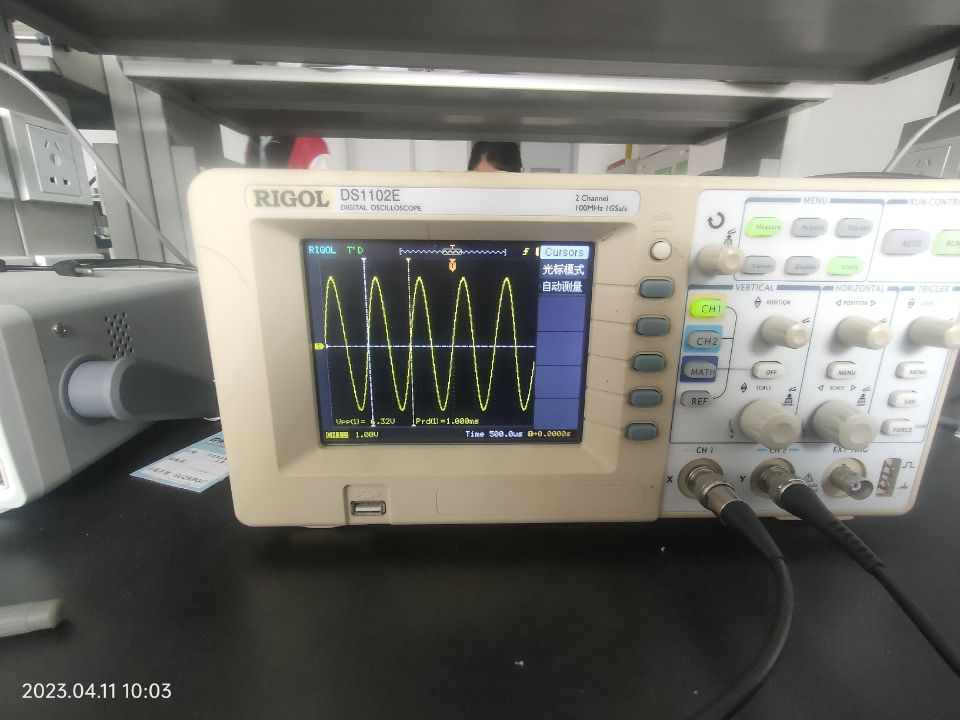
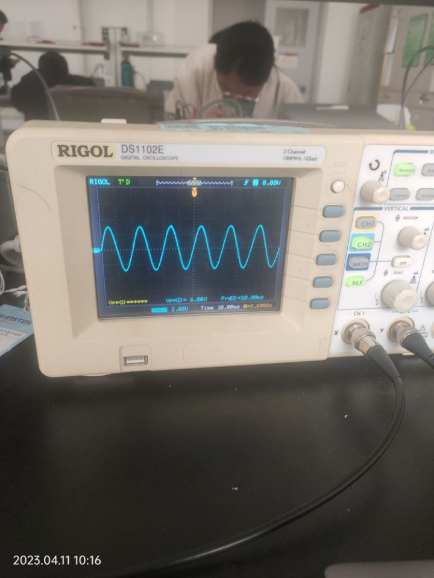
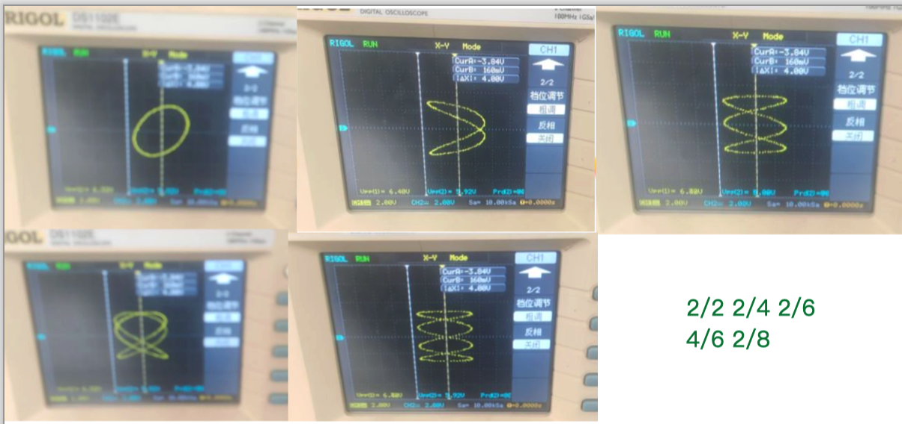
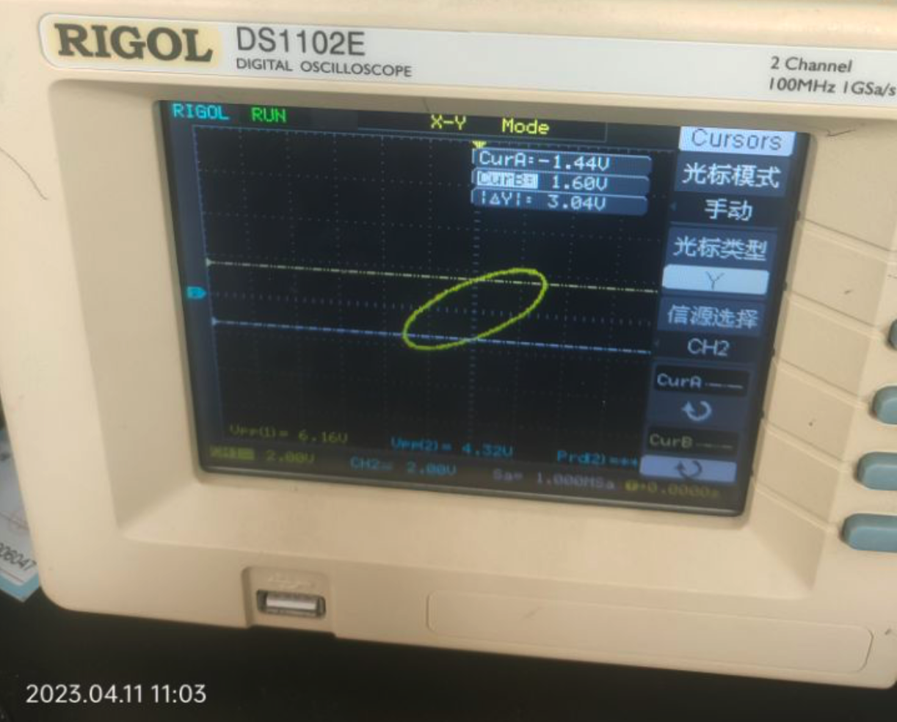

# 示波器的使用

姓名：田佳业 学院：计算机学院 学号：2013599 组别：A组座号：13号

实验日期：2020年4月11日 周二上午

### 仪器及用具

#### 仪器品牌与型号

示波器：RIGOL DS1102E  信号发生器：MFG-2120MA

#### 元件信息

电阻阻值：$1000.0\Omega$，电容值$0.1\mu F$

### 基本使用

将信号发生器信号（频率1KHz,电压峰-峰值约3V ）和市电小电压信号（频率约为50Hz，电压峰-峰值约为6V）同时输出到示波器CH1和CH2接口，分别稳定并形成适当的波形，重点熟悉触发对波形的作用。

探头1x 反向关闭

1ms,20ms

点一下position对准椭圆中心

思考题线索：转换虚数表达形式

### 实验数据

#### 信号源和变压器波形测量

| 信号源       | 自动测量 | 光标测量 | 读格测量 |
| ------------ | -------- | -------- | -------- |
| 电压(峰峰值) | 6.32V    | 6.48V    | 6.3V     |
| 周期         | 1.000ms  | 1.00ms   | 1ms      |
| 频率(计算)   | 10000Hz  | 10000Hz  | 10000Hz  |

| 变压器 | 自动测量 | 光标测量 | 读格测量 |
| ------ | -------- | -------- | -------- |
| 电压(峰峰值) | 6.00V | 6.01V | 6.0V |
| 周期         | 20.00ms | 20.00ms | 20ms |
| 频率(计算)   | 50Hz | 50Hz | 50Hz |

自动测量图片





#### 李萨如图测量市电频率

| $n_x/n_y$             | 2/2   | 2/4    | 2/6    | 2/8    | 2/8     |
| --------------------- | ----- | ------ | ------ | ------ | ------- |
| 函数发生器$f_x(Hz)$   | 50.00 | 100.00 | 150.00 | 200.00 | 75.00Hz |
| 算得市电频率$f_y(Hz)$ | 50.00 | 50.00  | 50.00  | 50.00  | 50.00Hz |



平均市电频率：50.00Hz

#### 测量RC电路相位差

连接电路，将信号发生器频率设为$f=1.59kHz$

##### 椭圆法

 $u_1$ 和 $u_2$ 之间的相位差为:
$$
|\theta|=\arcsin \frac{2 x_0}{2 x_m} \text { 或 }|\theta|=\arcsin \frac{2 y_0}{2 y_m}
$$
式中 $2 x_0$ 和 $2 x_m$ 分别是椭圆与横轴交点间的距离及椭圆在横轴的投影; $2 y_0$ 和 $2 y_m$ 分别为椭 圆与纵轴交点间的距离及椭圆在纵轴的投影。



$2x_0=4.40V$

$2x_m=6.26V$

$2y_0=3.04V$

$2y_m=4.32V$

据公式得到$\theta=0.780rad$

##### 位移法

$$
\theta=\frac{l}{l_0} \times 2\pi
$$
式中 $l_0$ 为波形一个周期的长度, $l_0$ 为两波形的位移。

$l=80.0us$

$l_0=632us$

据公式得到$\theta=0.795rad$

```python
x_0=4.40
x_m=6.26
y_0=3.04
y_m=4.32
theta_1=math.asin(x_0/x_m)
theta_2=math.asin(y_0/y_m)
avg=(theta_1+theta_2)/2
print(theta_1)
print(theta_2)
print(avg)
l=80
l0=632
theta=2*math.pi*l/l0
print(theta)
```

### 思考题

$R_c=\frac{1}{j\omega C}=-j\frac{1}{\omega C}$。当$U$为直流电压时，电路短路，无分压。为交流时，得到阻抗后采用相量法计算课依照正常的串联分压原则计算。