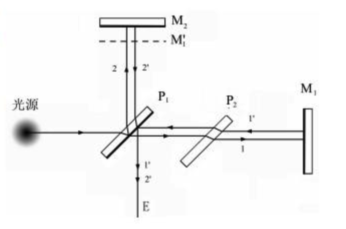
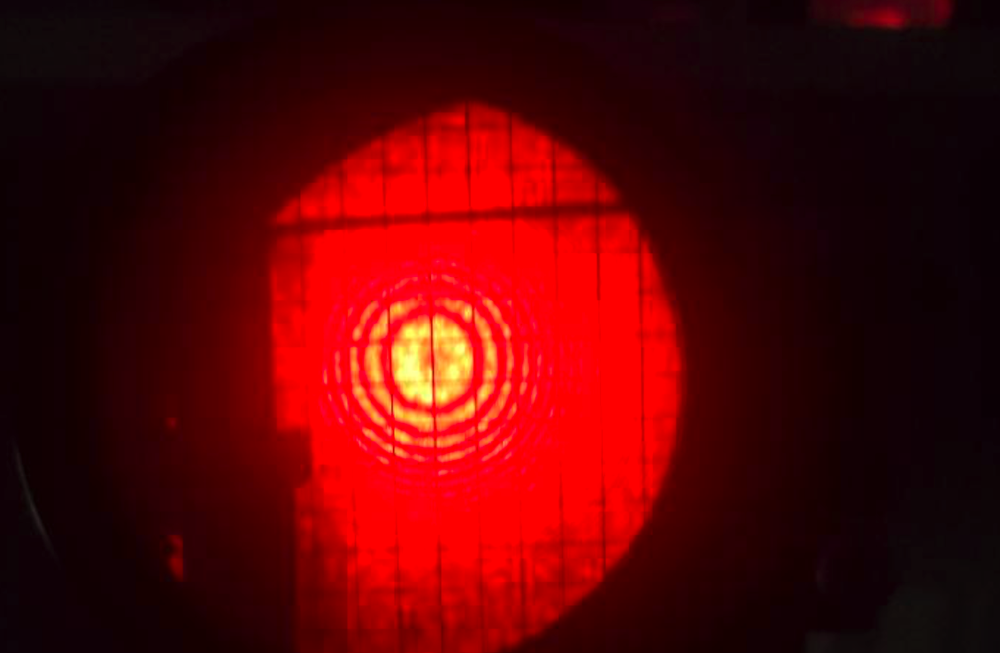
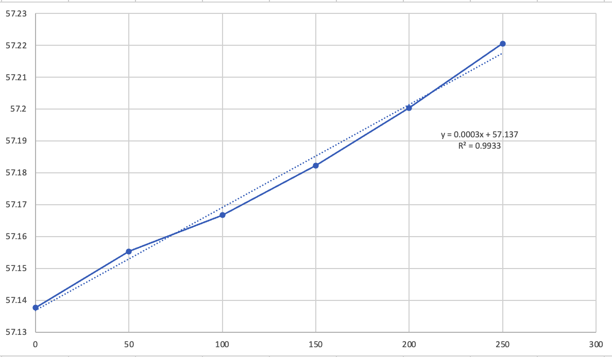
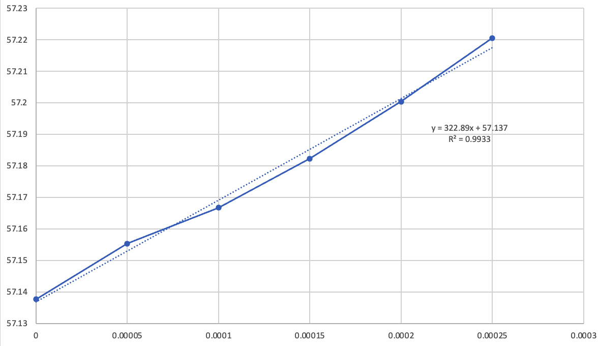

# 迈克尔逊干涉仪的调节与使用

田佳业 计算机学院 2013599 A组13号

2023.5.23

## 目的要求

1.了解迈克尔逊干涉仪的结构原理并掌握调节方法

2.观察等厚干涉、等倾干涉以及白光干涉

3.测量钠双线的波长差

## 实验原理

为什么需要补偿镜$P_2$？若没有补偿镜横着的透射光经过镜体一次，而反射光经过镜体三次。为了让两束要产生干涉的光线1和2在镜体内走过相同的光程，让光程只与$M$到半透半反镜的距离有关。补偿版的折射率与半透半反镜相同，以起到等效的作用。

而测量的原理是，当改变 $d$时光程差也相应发生改变, 这时在干涉条纹中心会出现 “冒出” 和 “缩进” 的 现象。当 $d$ 增加 $\lambda / 2$, 相应的光程差增加 $\lambda$, 在中心的条纹干涉级次由 $k$ 变为 $k+1$, 这样就会 “冒出”一个条纹：当 $d$ 减少 $\lambda/2$, 相应的光程差减少 $\lambda$, 在中心的条纹干涉级次由 $k$ 变为 $k$ -1 , 这样就会 “缩进”一个条纹。因此, 根据 “冒出” 或 “缩进” 条纹的个数可以确定 $d$ 的改变量, 它可以用来进行长度测量, 其精度是波长量级。当 “冒出” 或 “缩进” 了 $N$ 个 条纹, $d$ 的改变量 $\delta d$ 为:
$$
\delta d=N \frac{\lambda}{2}
$$

## 实验过程

如果一开始没看到干涉条纹，需要把观察镜摘掉，调节右侧手轮改变动镜前后和俯仰，让两束光的最亮位置重合。也即原理图中1‘和2’重合，才能产生干涉现象。

如果波纹过密，可以调节大的手轮，将$d的数值减小一些。

且由于啮合间隙的存在，必须进行单向测量。实验中也发现如果反向转手轮，一开始的干涉条纹是不会动的。

实验结果图：

## 数据处理

| 条纹移动数$N_1$      | 0        | 50       | 100      | 150      | 200      | 250      |
| -------------------- | -------- | -------- | -------- | -------- | -------- | -------- |
| 可移动镜位置$d_1/mm$ | 57.13761 | 57.15535 | 57.16670 | 57.18226 | 57.20035 | 57.22051 |

根据
$$
\delta d=N \frac{\lambda}{2}
$$

斜率的大小是半个波长。

由于斜率有效数字位数过少，故对数据进行处理，将每个 x 都乘以 $10^{-6}$ ,再次作图

得波长为$322.89×2=645.78nm$

$\lambda_{真}=632.8nm$

相对误差
$$
error=\frac{\lvert\lambda-\lambda_{真}\rvert}{\lambda_{真}}=2.05\%
$$
